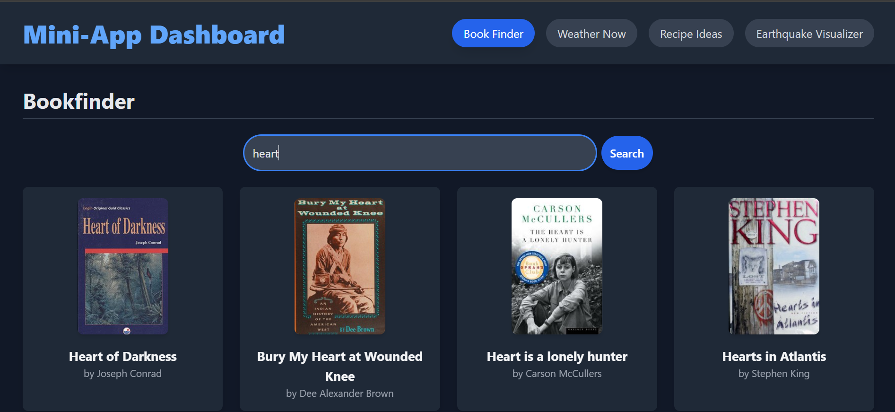
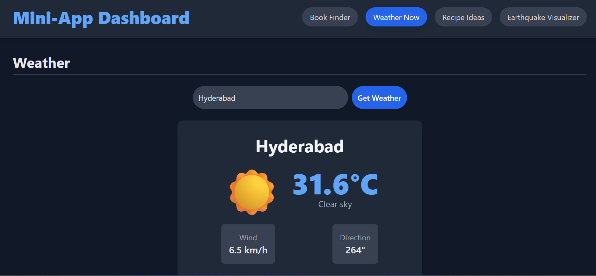
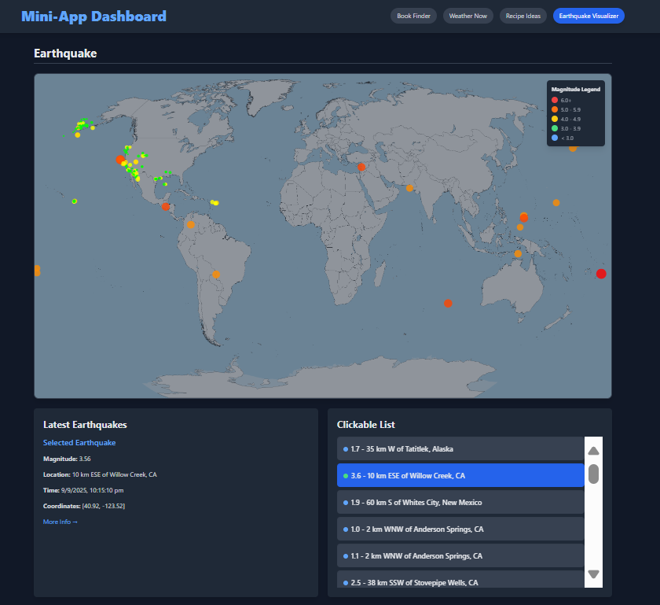

# 📊 Mini-App Dashboard  (Naukri_id : Naukri0925)

A single-page, responsive web application built with **React** that consolidates multiple mini-applications into one user-friendly dashboard.  
This project showcases the ability to create a **feature-rich application within a single file**, minimizing overhead and simplifying deployment.  

---

## ✨ Key Features  

- 📚 **Book Finder** → Search for books using the **Open Library API** and view details like author, publication year, and description.  
- 🌦️ **Weather Now** → Get current weather conditions for any city using the **Open-Meteo API**.  
- 🍳 **Recipe Ideas** → Find recipes based on a single ingredient using the **TheMealDB API**, with detailed instructions and YouTube links.  
- 🌍 **Earthquake Visualizer** → Display recent earthquakes on a **world map** using **USGS data**, with clickable markers for details.  

---

## ⚙️ Technical Overview  

- ⚡ **Single-File Architecture** → Entire app built inside `MiniApp.jsx` for **easy sharing, deployment, and understanding**.  
- 🔄 **Lightweight Navigation** → No external routing library — just a **switch-based transition system**.  
- 🌐 **Dynamic API Integration** → Fetches data from **public APIs** with `fetch()`.  
- ⚙️ **Hooks & State Management**:  
  - `useState` → Track user queries and API data.  
  - `useEffect` → Handle API calls & canvas rendering.  
- 🗺️ **Earthquake Visualizer** → Renders interactive markers for earthquakes on a world map.  
- 🎨 **Styling** → Powered by **Tailwind CSS** for a modern, responsive UI.  

---

## 🖼️ Screenshots  

<div>
  
</div>

<div>
  
</div>

<div>
  
</div>

<div>
  
</div>

---

## 🚀 Getting Started  

```bash
# Clone the repository
git clone https://github.com/Pranay9392/Aganitha.git

# Move into the project folder
cd Aganitha

# Install dependencies
npm install

# Start development server
npm run dev

# Build for production
npm run build

# Preview production build
npm run preview
